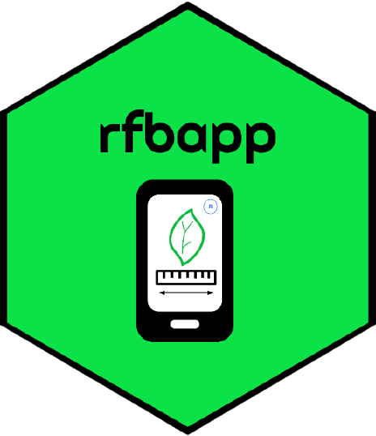
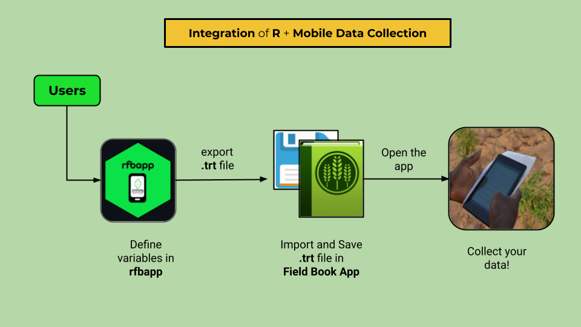

# *rfbapp*  

An R package to facilitate generating variable/trait forms for [Field Book App](https://play.google.com/store/apps/details?id=com.fieldbook.tracker&hl=es_PE&gl=US).

[rfbapp](https://github.com/Metrika-Group/rfbapp) aims at creating and automating customized variable/trait forms for *Field Book App*, a mobile phone application to collect data in the field and laboratory. Most frequently, users create variable or trait forms through the user  interface of the app one by one. However, it's quite intrincate to create variables outside of the application, and also it is not possible to save separately to share with others. With *rfbapp* users can automate the creation of multiples variables at once without interacting with the mobile application. It means, users would be able to save the form files in their PC.
Then, users are capable to export this form file in *.trt* format, to be finally load it in Field Book application. 

An important feature of `Field Book App` is that runs without any internet connection, making a plausible solution in places where there is no internet connection. It operates on `Android` devices and it **free** to use.

*rfbapp* supports the whole list types of variables available in Field Book App, such as:

- `Numerical variables`
- `Categorical variables`
- `Percentage variables` 
- `Audio record variables` 
- `Photo record variables` 
- `Date variables` 
- `GPS/Location variables`
- `Boolean variables` 
- `Free Text variables` 
- `Counting variables` 
- `Multi-categorical variables` 
- `Rust scoring variables` 

## Installation and Usage

You can install ``rfbapp` using:

``` r
if (!require("remotes"))
  install.packages("remotes")
remotes::install_github("Metrika-Group/rfbapp")
```
Load `rfbapp` in your R console

``` r
library(rfbapp)
```

More details in the website (under construction)

## Workflow

The main workflow consist of three steps:

1. Create and define your form variables with `rfbapp` and export it in `.trt` file.
2. Transfer `.trt` in the `trait` folder of the `Field Book App`
3. Go, collect your data!





