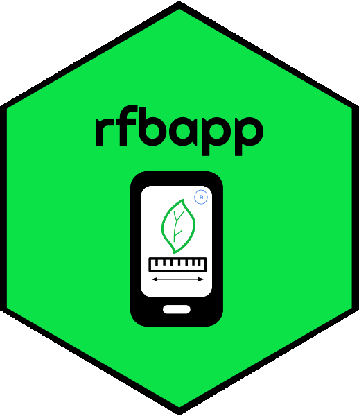

# *rfbapp*: Create FieldBook App templates for mobile data collection

*rfabpp* is an r-package that serve as generator of variables for Field Book App. 

*rfabpp* aims at creating and automating customized variables in *Field Book App*, a mobile phone application to collect data in the field and laboratory. Most frequently, users create variables through the user interface of the application one after the other. However, with rfbapp users can automate the creation of multiples variables at once. After that users are able to export them in a *.trt* file to be imported in Field Book App's trait folder. 

*rfbapp* supports the whole list types of variables available in Field Book App, such as:

- `Numerical variables`
- `Categorical variables`
- `Percentage variables` 
- `Audio record variables` 
- `Photo record variables` 
- `Date variables` 
- `GPS/Location variables`
- `Boolean variables` 
- `Free Text variables` 
- `Counting variables` 
- `Multi-categorical variables` 
- `Rust scoring variables` 

## Workflow

Crear una imagen con el workflow

